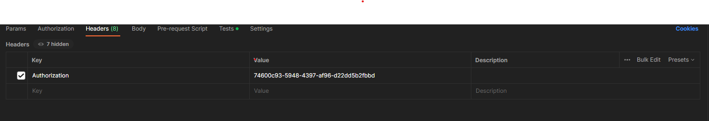

# EzWatchTicketing

An online platform for simplifying the process of watching your favorite movie. From choosing a movie to selecting your seat of choice it's never been this much easier. 

The repo will basically hold the APIs for the website. The is for building the API mainly.

## Frontend Design Prototype

View the frontend design live at [here](https://www.figma.com/community/file/1271040730437769653)

## Technical Details

- DotNet Framework Version: 4.7.2
- Architecture Used: MVC Web API Tier Architecture
- SQL Server: MSSQL Server 2022
- Data Developement Model: Code-First Using Entity Framework

## Project Scenario

There are 4 users in this project: (1) General User, (2) Employee, (3) Admin & (4) Manager. Each user will have different kinds of entities. Each user will have different API endpoints. Most of the API endpoints will be served based on **rolse based authentication**. Some API routes will have combined results outcomes and those will be gained by combining different user tables or entities & those APIs will be called **feature API**. 

## Authentication

We use **bearer token** role based authentication in our APIs. An User must ***login*** first, then grab the **token** & pass that token as `Authorization` header in requests. The format for passing the token is shown below

### Example Authentication Image

## Endpoints

We do the API testing on **Postman**. So I have decided to document the API on postman first. You can find the API endpoints and documentation on them [here](https://documenter.getpostman.com/view/21420955/2s9Y5SWkpi)

## Contributors

- [Abir-Tx](https://github.com/Abir-Tx)
- [Asif Hossain Neloy](https://github.com/AsifNeloy)
- [Masavi Syed](https://github.com/Masavi99)
- [Marina Afroj](https://github.com/marina-afroj)
